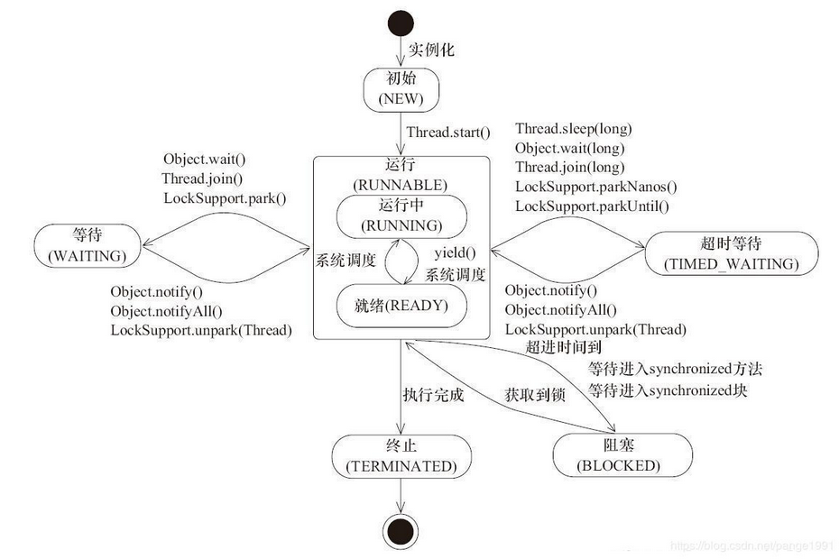

07.19晚仿面试

1. #### 讲下static关键字

   * 被修饰的资源无论有多少个实例，都会只被执行一次
   * 静态资源只能调用静态资源，实例资源里面能引用静态资源和实例资源
   * 静态属性在准备阶段初始化，初始化阶段被赋值，非静态在使用阶段被赋值 
   * 静态方法中不能使用this 
   * 外界访问静态资源时可以不用创建实例
   * 静态代码块只能定义在类里面，不能定义在方法里面 
   * 静态代码块对于定义在它之后的静态变量，可以赋值，但是不能访问 

2. #### 线程状态

线程状态可分为5种，分别是创建，就绪，运行，阻塞，等待，超时等待，终止

* 初始(NEW)： 实现Runnable接口和继承Thread可以得到一个线程类，new一个实例出来，线程就进入了初始状态。 

  > 线程**执行start方法是新建了一个线程，而执行run方法并不会执行创建一个线程**，是相当于直接执行了一个Thread类的run方法

* 就绪：此时只是在等待队列

  * 调用线程的start()方法，此线程进入就绪状态。
  * 当前线程sleep()方法结束，其他线程join()结束，等待用户输入完毕，某个线程拿到对象锁，这些线程也将进入就绪状态。
  * 当前线程时间片用完了，调用当前线程的yield()方法，当前线程进入就绪状态。
  * 锁池里的线程拿到对象锁后，进入就绪状态。

* 运行(RUNNABLE)：Java线程中将就绪（ready）和运行中（running）两种状态笼统的称为“运行”。

  * 线程对象创建后，其他线程(比如main线程）调用了该对象的start()方法。该状态的线程位于可运行线程池中，等待被线程调度选中，获取CPU的使用权，此时处于就绪状态（ready）。就绪状态的线程在获得CPU时间片后变为运行中状态（running）。

* 阻塞(BLOCKED)：表示线程阻塞于锁。

* 等待(WAITING)：进入该状态的线程需要等待其他线程做出一些特定动作（通知或中断）。

* 超时等待(TIMED_WAITING)：该状态不同于WAITING，它可以在指定的时间后自行返回。

* 终止(TERMINATED)：表示该线程已经执行完毕。

3. #### 抽象类和接口

相同点：

1. 都不能被实例化。
2. 接口的实现类和抽象类的子类只有全部实现了接口或者抽象类中的方法后才可以被实例化。

 不同点：

1. 接口只能定义抽象方法不能实现方法，抽象类既可以定义抽象方法，也可以实现方法。

2. 单继承，多实现。接口可以实现多个，只能继承一个抽象类。

3. 接口强调的是功能，抽象类强调的是所属关系。

4. 接口中的所有成员变量 为public static final， 静态不可修改，当然必须初始化。接口中的所有方法都是public abstract 公开抽象的。而且不能有构造方法。抽象类就比较自由了，和普通的类差不多，可以有抽象方法也可以没有，可以有正常的方法，也可以没有。

     

#### 4.8大基本类型

​	整型 byte short int long

​		byte：1个字节

​		short：2个字节

​		int：4个字节

​		long：8个字节

浮点型 float double

​		float：4个字节

​		double：8个字节

逻辑型 boolean(它只有两个值可取true false)
字符型 char 

​		char：1个Unicode字符码(2个字节)	范围：0~127

5. #### 异常

   