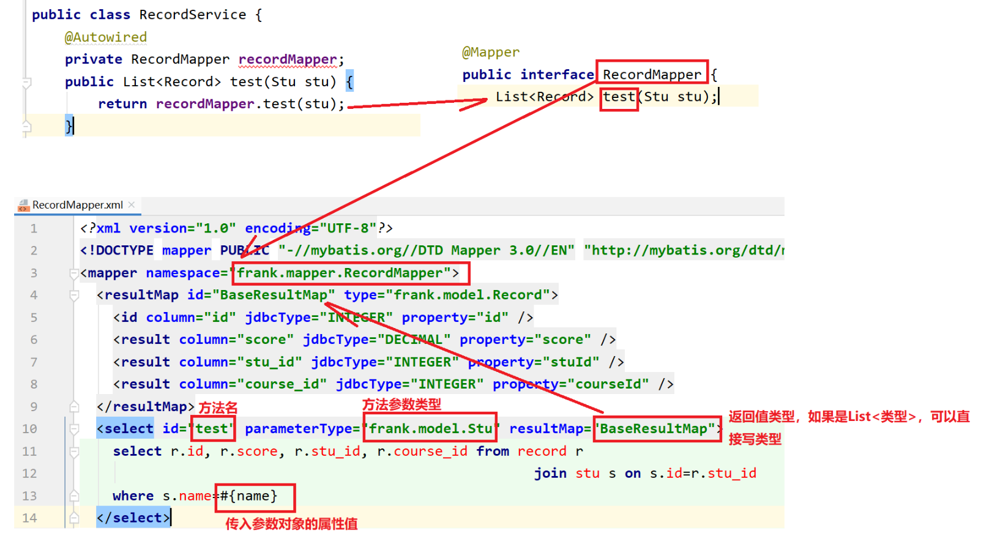

## Spring

Beans模块（容器）：是工厂模式的经典实现，Spring将管理对象称为Bean

Core核心模块：Spring框架的基本组成部分，包括IOC和DI功能

Context上下文模块：访问和配置对象的媒介

---

Bean容器：提供管理Java对象的容器

IOC：控制反转，一种设计原则，用来降低代码间的耦合度

> 实例的创建不再由调用者管理，而是由Spring容器创建，控制权由程序代码转到了Spring容器中，控制权发生了反转

DI：依赖注入，为Bean对象注入依赖属性

> 实现方式：属性注入，构造方法注入

## SpringBoot

​	它里面内置了许多默认的配置，（启动类中，自动完成的工作）

扫描类上的注解

---

初始化一个对象：

@Configuration	//配置类，启动时做配置性工作

@Bean //配置类方法上的，以返回值作为Bean的实例对象，注入容器中

> Bean的名称为方法名

---

初始化实例一个对象，表示一个组件(Bean)

**@Component**  //仅仅表示一个组件(Bean)，**可作用任何层次**

@Repository  //用于**数据访问层(Dao层)**的类标识

@Service	//作用于**业务层（Service层**）

**@Controller** 	//作用在**控制层**（如Struts2的Action ）

---

**@RequestMapping**	//路径，可放在配置类前，也可放在配置类方法上

**@ResponseBody**	//返回格式是json

---

装配Bean的方式

@Autowired		//得到一个Bean对象，属于Spring提供的注解

@Resource 		//得到一个Bean对象，属于JDK提供的注解

面试题：**@Autowired和@Resource 的区别**

① 如果变量名和bean名不一致，需要手动指定，@Autowired+Qualifier(“bean名称”)，@Resource(name=“bean名称”)

② 属于Spring提供的注解，属于JDK提供的注解

---

Controller中，请求数据的方式：

（1）路径变量：url中定义{变量名}作为占位符，使用@PathVariable，

（2）@RequestParam：可以处理url中请求参数，请求数据类型为x-www-form-urlencoded和from-data时，也可以获取到数据

（3）**@RequestBody**：请求格式为application/json时，解析为对象

（4）直接使用servlet的request和response对象

---

拦截器

@ControllerAdvice 	//重写返回体，统一数据封装

@ControllerAdvice+@ExceptionHandler		//统一处理异常

WebMvcConfigurer接口实现addInterceptors重写		//配置拦截器，拦截访问作用

---

AOP：面向切面编程，将业务逻辑的各个部分进行隔离

应用场景：需要在具体的业务方法前后，执行统一业务逻辑处理的代码

面试题：**实现AOP的方式**

1. JDK实现

   > 通过Proxy的newProxyInstance()方法和InvocationHangler来实现，前提就是被代理类需要实现某一个接口，运行时动态的生成代理类(可以是内部类)
   >
   > 原理：
   >
   > 前置知识: java文件在编译期编译为class字节码，运行时加载对应类到方法区
   >
   > (1)运行期，根据被代理类，生成代理类的字节码，将被代理类包装到代理类中
   >
   > (2)被代理类方法执行前后，插入统- -处理逻辑
   >
   > (3)使用的时候:使用代理类,不再使用被代理类(代理类中已经包裹 了被代理类)

2. CGLIB的实现方式

   > MethodInterceptor完成方法执行前后的业务逻辑插入
   >
   > 在通过ASM字节码技术，生成代理类的字节码
   >
   > 前置条件:被代理类不需要实现接口，但不能为final修饰
   >
   > **Spring框架代理时:会根据是否实现接口来决定使用哪一种动态代理**

---

## Mybaits

ORM：通过实例对象的语法（把数据库映射成对象），完成操作关系型数据库的技术

背景：jdbc操作麻烦，有加载驱动，创建连接，创建操作命令对象Statement，执行sql，处理结果，释放这一类繁琐的步骤

面试：Hibernate和Mybaits的区别？

* Hibernate可以不需要写大量的SQL就可以映射，但要多消耗性能，Mybaits需要SQL语句，但做sql优化工作比较方便
* Hibernate是全自动ORM框架，以Java对象表示数据库的关系，自动完成sql的包装，并且跨数据库，Mybaits是半自动ORM框架
* Hibernate适合数据库设计上比较稳定的场景，Mybaits适合数据库调整比较大（快速迭代开发）

Mybaits包含的部分

1. 实体——替换占位符，结果集返回
2. sql——xml中配置sql
3. 提供方法完成sql的处理：public 返回类型【结果集处理后返回的对象】 方法名【对应xml中sql的id】(传入参数【要替换占位符的数据】)

