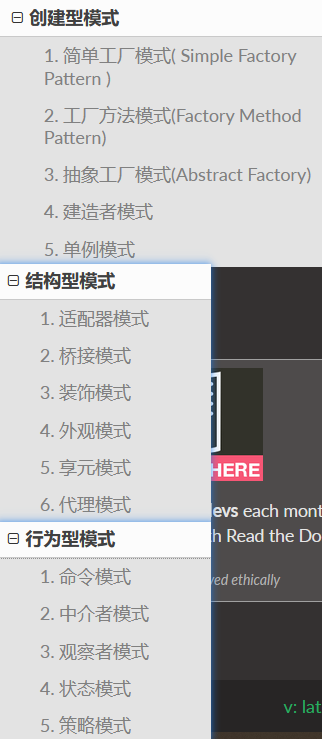

## 设计模式

* **创建型模式 ——创建对象** ：单例、工厂模式、原型模式、建造者模式

​	单例——保证全局的单例类只有一个实例，使用时直接获取，如数据库的连接(jdbc)类

> 一般有5种写法
>
> 第一种是饿汉模式，先把单例进行实例化，获取的时候通过静态方法直接获取即可。缺点是类加载后就完成了类的实例化，浪费部分空间。
>
> 第二种是饱汉模式，先把单例置为null，然后通过静态方法获取单例时再进行实例化，但是可能有多线程同时进行实例化，会出现并发问题。
>
> 第三种是逐步改进的方法，一开始可以用synchronized关键字进行同步，但是开销太大，而后改成使用volatile修饰单例，然后通过一次检查判断单例是否已初始化，如果未初始化就使用synchronized代码块，再次检查单例防止在这期间被初始化，而后才真正进行初始化。
>
> 第四种是使用静态内部类来实现，静态内部类只在被使用的时候才进行初始化，所以在内部类中进行单例的实例化，只有用到的时候才会运行实例化代码。然后外部类再通过静态方法返回静态内部类的单例即可。
>
> 第五种是枚举类，枚举类的底层实现其实也是内部类。枚举类确保每个类对象在全局是唯一的。所以保证它是单例，这个方法是最简单的。

​	工厂模式——一个工厂服务一个接口，为这个接口的实现类进行实例化，来创建多个类的实例

​	原型模式——通过一个实例进行克隆从而获得更多同一原型的实例。使用实例的clone方法即可完成。

​	建造者模式—— 将一个复杂的对象的**构建**与它的**表示**分离 ， 通过子类继承或者重载的方式，动态的创建具有复合属性的对象 

* **结构性模式—— 代码扩展**：桥接模式、适配器模式、享元模式、代理模式、外观模式、组合模式、装饰者模式、装饰者

  适配器模式——  将两个不同的类进行适配，把鸡包装成鸭，然后当做鸭来使用 

  享元模式—— 复用已经生成的对象 ，（类似于session）

  代理模式——一个中介，由代理对象控制原对象，类似我们买房时只需要挑房掏钱，中介负责找房办理过户

  外观模式——调用一个方法就得到需要的内容

  组合模式——类里也可有类，很多例子如链表，树的实现

* **行为型模式——  关注的是各个类之间的相互作用** ：策略模式、命令模式 、模板方法模式、观察者模式 、责任链模式

  策略模式—— 把一个策略作为一个类  ，并且在需要指定策略的时候传入实例， 如Jackson

  命令模式—— 命令模式一般分为命令发起者，命令以及命令接受者三个角色。  比如遥控器按钮相当于一条命令，点击按钮时命令运行，自动调用电视机提供的方法即可。 

  模板方法模式—— 提供了一个方法模板，并且其中有部分实现类和部分抽象类，并且规定了执行顺序。 

   观察者模式—— 方式消息推送耦合关系，后来为了使数据格式更加灵活，使用了事件和事件监听器的模式，事件包装的事件类型和事件数据，从主题和观察者中解耦，例如连接池的size

  责任链—— 责任链通常需要先建立一个单向链表，然后调用方只需要调用头部节点就可以了，后面会自动流转下去  

