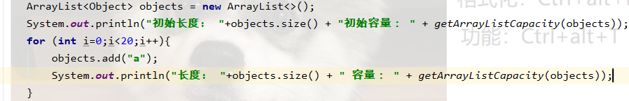
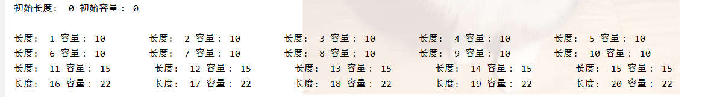
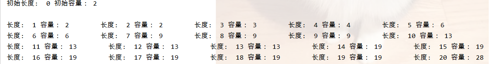
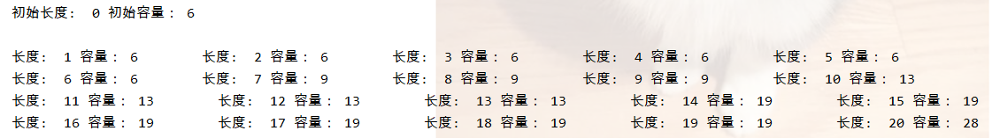

## 集合框架

1. #### 谈下你了解的集合

   首先，Colletion接口下有List接口，Set接口，List接口下的实现类有ArrayList，linkedlist，vector等等，一般就是用前两个。

   ArrayList查询快，增删慢，它的扩容方式是

   > * 如果用**默认构造方法**建立时默认容量是0，当触发第一次add方法时，它的容量会变为10，之后每达到一次最大容量时，就会以1.5倍的速度进行扩容
   >
   > 
   >
   > 
   >
   > 
   >
   > * 如果用**自定义的初始容量**构造方法创建时,
   >
   > > * 当声明的容量小于5 时，每次add都会是使容量加1，当到5时就会以1.5倍进行扩容
   > >
   > > 
   > >
   > > 
   > >
   > > * 当声明的容量大于等于5 时，就一直以1.5倍来进行扩容
   > >
   > >   

   

   LinkedList 查询慢，增删快，是一个双向链表结构，不涉及扩容的问题。

   vector相当于线程安全的ArrayList，它里面用了大量的synchronized来修饰，故会消耗大量资源，它的扩容机制和ArrayList相差不大，只不过它是以2倍来进行扩容

   Set接口下和List接口实现的类最大的区别就是Set接口下的实现类不允许有重复元素，他的实现类有HashSet类，TreeSet类，HashSet对象的元素无序，底层数据结构是哈希表 ，(12,0.75,16,2^n);为了弥补他的缺陷，他又有一个子类LinkedHashSet，这个保证了他的有序，而TreeSet类底层是二叉树，可以实现对元素的排序

而其次还有一个Map集合，它的实现类有HashMap、TreeMap、HashTable，

HashMap类是以键值对的形式来存储数据，它的默认初始长度为16，默认负载因子为0.75，阈值为哈希桶长度*负载因子(16\*0.75=12)，当元素个数达到阈值时就开始触发扩容，它是将原哈希桶的数量扩至符合小于阈值要求的最近一个2^n值，遍历原哈希表，通过key的hashcode方法(一般常是除数取余法和散列法)来重新计算下标值，这里调用了hash方法，hash方法就是让key的高16位与低16位进行异或，结果再与（哈希桶的长度-1）进行与操作就可以得到下标值，并通过equals方法来判断是否为同一对象，如果有数据重复的进行替换，没有则新添，依次赋值

在jdk1.7时hashmap 是通过数组+链表实现的， 由于hashmap非线程安全且是用头插法存储数据，扩容时如果多线程并发进行操作，则可能有两个线程分别操作新表和旧表，导致节点成环，查询时会形成死循环，而且由于他的非线程安全的，所以当它put时会带来数据覆盖的可能性

在jdk1.8时hashmap 是通过数组+链表/红黑树实现的，当哈希桶长度超过64且链表长度超过8个时，链表会转化成红黑树，而当红黑树元素个数减少到6个时，又会转化成链表，在jdk1.8时用的是尾插法存储数据，故就避免了扩容时带来的死循环问题，但还是有数据覆盖的问题

HashTable相当于线程安全的hashmap ，它里面也是用了大量的synchronized来修饰方法，故它的确实线程安全的，但是低效,但是它不允许null为key和value值

#### 2. 如何来满足想用一个线程安全的ArrayList需求

1. vector：它里面用了大量的synchronized来修饰，故会消耗大量资源，不推荐

2.  Collections下的synchronizedList方法 ， get, set, add 等操作都加了 mutex 对象锁，再将操作委托给最初传入的 list ，实际的操作都是在原非线程安全对象上进行，只是在操作前给加了同步锁 

#### 3. 如何来满足想用一个线程安全的HashMap需求

> 注意：HashTable和ConcurrentHashMap都不允许null为key和value

1. HashTable：它里面用了大量的synchronized来修饰，故会消耗大量资源，不推荐

2. Collections下的synchronizedMap方法 ， get, set, put 等操作都加了 mutex 对象锁，再将操作委托给最初传入的 list ，实际的操作都是在原非线程安全对象上进行，只是在操作前给加了同步锁

3. **ConcurrentHashMap**:

   在jdk1.7时，利用了segment分段锁技术，在多线程并发时，对同一个segment进行同步加锁，保证线程的安全，这样就可基于不同的segment进行**并发写操作**，它同步加锁的实现方式也是基于ReentrantLonk锁机制，

   在jdk1.8时，它是利用了CAS+synchronized保证多线程的，当put元素时，通过hashcode计算出下标值，如果当前索引位置没有元素，就使用CAS插入元素，如果存在元素，就使用synchronized锁住该下标位置元素的头节点(链表/红黑树),在进行插入，所以ConcurrentHashMap也只是在它put时下标位置有元素时才进行加锁，这样就不能保证读操作，而value是用volatile修饰的，保证了可见性，故读写分离，而此时读写分离可以增加效率