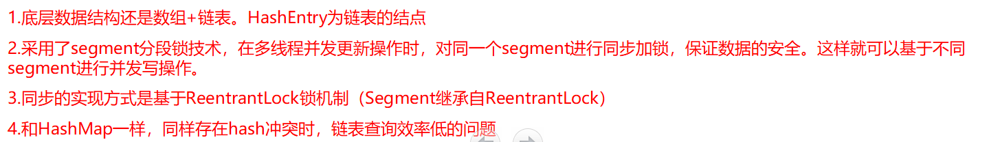
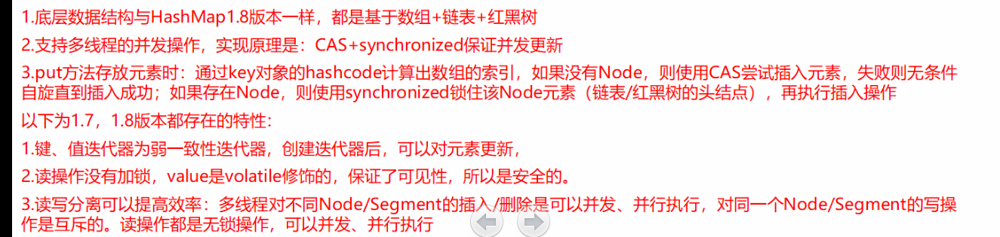
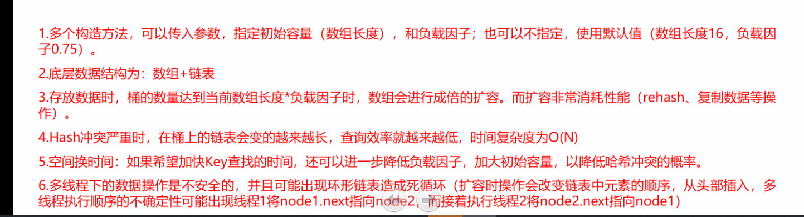
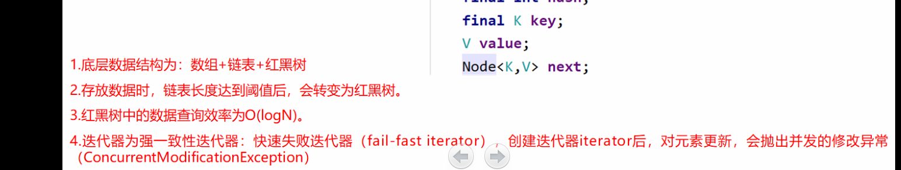
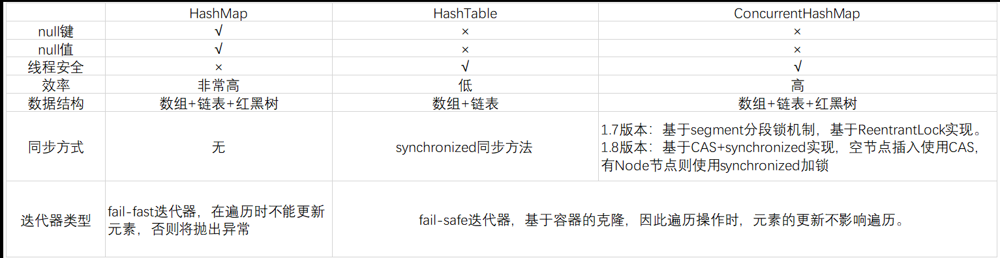

## ConcurrentHashMap

**问题描述**：

​		聊下ConcurrentHashMap和HashMap

---

#### ConcurrentHashMap

##### 1.7

##### 1.8

#### HashMap

##### 1.7

##### 1.8

---

### HashMap、HashTable、ConcurrentHashMap的区别

