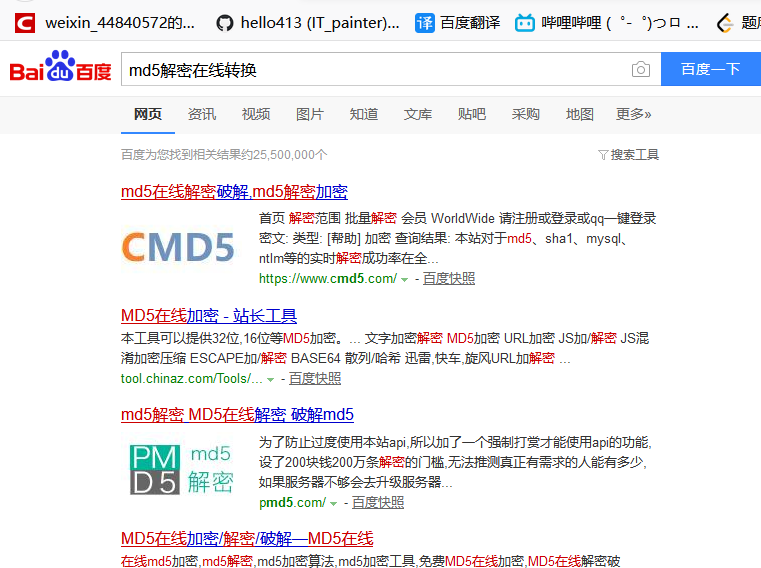

## 为什么MD5算法要加密两次

**问题描述**：

​		为什么MD5算要加密两次

---

#### 用户端加密

> 为了防止密码明文在http上传输，则需要在前端进行一次md5 salt加密 

##### 使用方式：

 前端JQuery md5工具：https://github.com/emn178/js-md5 

```javascript
//首先先声明盐
var SALT="1C2t3p4a5i";
var password = md5(str);
```

---

#### 服务端加密

> 服务端将拿到第一次md5加密的结果，这个密码就是表单提交上来的密码，我们需要在后端编写第二道md5加密方式来加密表单传来的密码后再与`数据库存储的两次md5加密的密码`进行比较，相同才能登陆成功 

##### 使用方式：

* **方法一**：使用依赖

  ```
  	<dependency>
  		<groupId>commons-codec</groupId>
  		<artifactId>commons-codec</artifactId>
  		<version>1.9</version>
  	</dependency>
  	<dependency>
  		<groupId>org.apache.commons</groupId>
  		<artifactId>commons-lang3</artifactId>
  		<version>3.6</version>
  	</dependency>
  ```

  使用其MD5方法

* **方法二**：由于Spring可以说是自带MD5算法   (DigestUtils类)

```
private static final String SALT = "1C2t3p4a5i";
private static String md5(String password){
    return SALT.charAt(5)+DigestUtils.md5DigestAsHex(password.getBytes())+SALT;
}
```

---

##### 好了，言归正传：为啥他要使用两次呢

​	因为：

恐怖吧！一般能抓到我们加密数据的都是程序员，一次可能防不了他们，二次的话目前还行，但我估计... 可能以后要用到更多