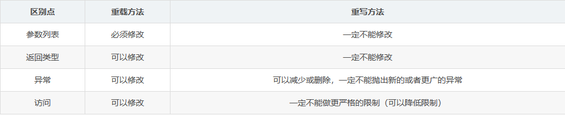

## 重载和重写

方法重载：
1、同一个类中
2、方法名相同，参数列表不同（参数顺序、个数、类型）
3、方法返回值、访问修饰符任意
4、与方法的参数名无关

方法重写：
1、有继承关系的子类中
2、方法名相同，参数列表相同（参数顺序、个数、类型），方法返回值相同
3、访问修饰符，访问范围需要大于等于父类的访问范围

​		public > protected > 默认 > private

4、与方法的参数名无关

---

